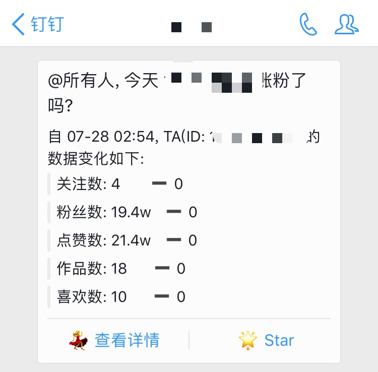

# 今天涨粉了吗

抓取抖音名片并推送到钉钉群

> 这只是一个示例脚本, 本身不属于 idy 项目, 你可以自行拓展用法

## 使用

- 切换到 `is_it_up_today.py` 脚本目录下
- 在脚本目录下创建 `config.json`, 配置格式如下:

```json
{
  "idy_path": "<idy 程序路径>",
  "url_configs": {
    "<抖音名片地址1": [
      "<钉钉群机器人1 URL>",
      "<钉钉群机器人2 URL>"
    ],
    "<抖音名片地址2>": [
      "<钉钉群机器人3 URL>",
      "<钉钉群机器人4 URL>"
    ]
  }
}
```

- 执行 `python is_it_up_today.py` (**PS:** 你可以使用定时任务触发达到定时推送的效果) 

## 效果展示


